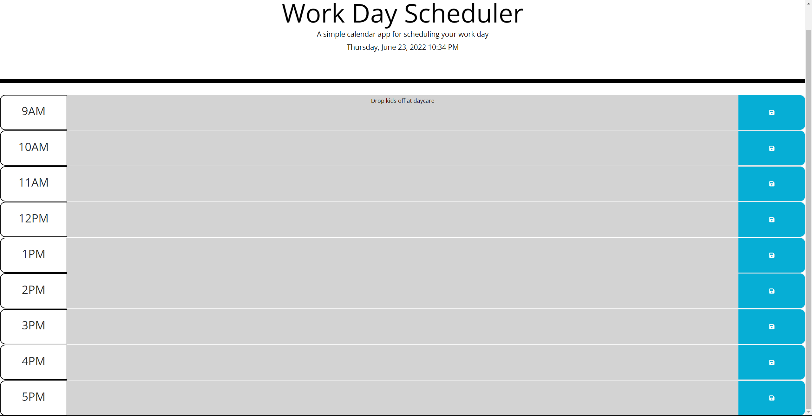
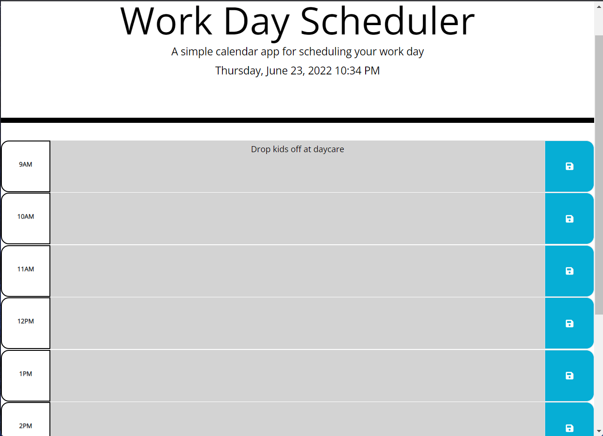

I created a work day scheduling app that allows you to create and edit events throughout the work day. While the time is 3:xx PM the 3PM time slot will be colored red and bold, indicating that it is the current timeslot. Gray is used for times that have passed, and green for upcoming times/events. 

All of the event info can be saved to localstorage and added directly to the textarea on page load. 

This app also displays the current day/date/time at the top of the page and updates every 1 second to make sure you're at the correct minute.

Here is a link to the deployed application: 
https://rdoolz51.github.io/RDCalendarChallenge/
<h3> This is an image showing the calendar on a large screen. </h3>

<h3> This is an image displaying the responsiveness of the calendar </h3>
